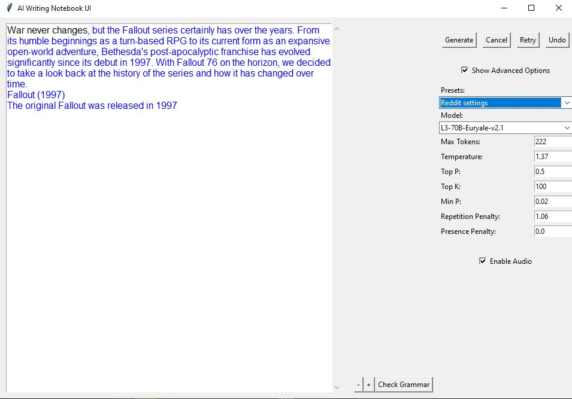

# AI Writing Notebook UI



## Description
A GUI-based AI writing assistant that supports text generation, session saving and loading, advanced options toggling, and voice generation for the generated text, made to work out of the box for infermatic users, just remove the .example from the `config.json.example` and fill in the required `INFERMATIC_API_KEY` key with your API key from [Infermatic](https://ui.infermatic.ai/) and optionally fill in the `NOVELAI_API_KEY` key with your API key from [NovelAI](https://novelai.net/) for voice generation support (Account Settings > Account > Get Persistent API Token).

## Features
- **Text Generation:** Generates text based on the provided prompt using AI models.
- **Session Management:** Saves and loads the current session to resume writing from where you left off.
- **Advanced Options:** Provides additional settings that can be toggled on or off for more nuanced control over the text generation process.
- **Voice Generation:** Converts the generated text into speech for auditory feedback.
- **Accessibility:** Supports text font size adjustment for better readability and the generated text is highlighted in blue for easy identification.

## Usage
### Starting the Application:
- Rename `config.json.example` to `config.json` and fill in the required fields, leave `USE_TTS` as `false` if you don't have a NovelAI API key.
- Run the application by opening the `start.bat` file or running `python main.py` in the terminal.
- The application window will open, and you can begin typing your prompt in the text area.

### Text Generation:
- Type your prompt in the text area and click the "Generate" button to generate text based on the AI model.
- The generated text will be appended to the text area with a blue highlight.

### Session Management:
- The application automatically saves your session when you close the window.

### Advanced Options:
- Toggle the advanced options to adjust parameters like temperature, top_k, presence_penalty, min_p, and top_p, etc. for more control over the text generation.

### Voice Generation:
- If enabled, the generated text will be converted to speech using the voice generation feature.

## Requirements
- Python 3.x
- Tkinter (`sudo apt-get install python-tk` or `sudo apt-get install python3-tk` for python3)

## Installation
```bash
pip install -r requirements.txt
```

## License
- This project is licensed under the MIT License - see the `LICENSE` file for details.
